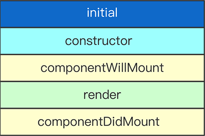
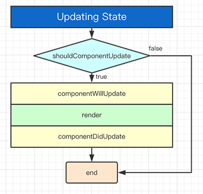

## 简介

在使用`React`创建组件的过程中，会调用一个`render`方法，以及触发若干生命周期的方法。

接下来，这篇文章会讲一讲这些生命周期的方法是何时被执行的。

理解组件的生命周期，当组件被创建或销毁时，可以执行某些操作。此外，当 `props` 和 `state` 发生改变的时候，你可以利用这些生命周期的钩子来改变你的组件。

## 生命周期

为了清楚的了解生命周期，我们需要明白 **组件初始化** ，**`state` 改变** ， **`props` 改变** ， **组件卸载** ，以及调用 **`forceUpdate()`** 时，哪些钩子函数会被执行。

## 组件初始化



### **constructor()**

`React`组件的构造函数将会在装配之前被调用。当为一个`React.Component`子类定义构造函数时，你应该在任何其他的表达式之前调用`super(props)`。否则，this.props在构造函数中将是未定义。

构造函数是初始化状态的合适位置。若你不初始化状态且不绑定方法，那你也不需要为你的React组件定义一个构造函数。

可以基于属性来初始化状态。这样有效地“分离（forks）”属性并根据初始属性设置状态。这有一个有效的`React.Component`子类构造函数的例子：

```
constructor(props) {
  super(props);
  this.state = {
    color: props.initialColor
  };
}
```

### **componentWillMount()**

```
componentWillMount()
```

`componentWillMount()`在装配发生前被立刻调用。其在`render()`之前被调用，因此在这方法里同步地设置状态将不会触发重渲。避免在该方法中引入任何的副作用或订阅。

这是唯一的会在服务端渲染调起的生命周期钩子函数。通常地，我们推荐使用`constructor()`来替代。

### **render()**

`render()`方法是必须的。

当被调用时，其应该检查`this.props` 和 `this.state`并返回以下类型中的一个:


* React元素。 通常是由 JSX 创建。该元素可能是一个原生DOM组件的表示，如<div />，或者是一个你定义的合成组件。
* 字符串和数字。 这些将被渲染为 DOM 中的 text node。
* Portals。 由 ReactDOM.createPortal 创建。
* null。 什么都不渲染。
* 布尔值。 什么都不渲染。（通常存在于 return test && <Child />写法，其中 test 是布尔值。）


当返回`null` 或 `false`时，`ReactDOM.findDOMNode(this)` 将返回 `null`。
`render()`函数应该纯净，意味着其不应该改变组件的状态，其每次调用都应返回相同的结果，同时不直接和浏览器交互。若需要和浏览器交互，将任务放在componentDidMount()阶段或其他的生命周期方法。保持render() 方法纯净使得组件更容易思考。

> 注意
> 若 `shouldComponentUpdate()` 返回`false`，`render()`函数将不会被调用。

### **componentDidMount()**

```
componentDidMount()
```

`componentDidMount()`在组件被装配后立即调用。初始化使得DOM节点应该进行到这里。若你需要从远端加载数据，这是一个适合实现网络请求的地方。在该方法里设置状态将会触发重渲。

## State Changes



### shouldComponentUpdate()


```
shouldComponentUpdate(nextProps, nextState)
```

使用`shouldComponentUpdate()`以让`React`知道当前状态或属性的改变是否不影响组件的输出。默认行为是在每一次状态的改变重渲，在大部分情况下你应该依赖于默认行为。

当接收到新属性或状态时，`shouldComponentUpdate()`在渲染前被调用。默认为`true`。该方法并不会在初始化渲染或当使用`forceUpdate()`时被调用。

当他们状态改变时，返回`false` 并不能阻止子组件重渲。

> 注意：如果只定义方法，不写任何返回值，会提示：`shouldComponentUpdate(): Returned undefined instead of a boolean value.`

注意即使属性未有任何改变，`React`可能也会调用该方法，因此若你想要处理改变，请确保比较当前和之后的值。这可能会发生在当父组件引起你的组件重渲。

在**装配**期间，React并不会调用带有初始属性的`componentWillReceiveProps`方法。其仅会调用该方法如果某些组件的属性可能更新。调用`this.setState`通常不会触发`componentWillReceiveProps`。

### componentWillUpdate()

```
componentWillUpdate(nextProps, nextState)
```

当接收到新属性或状态时，`componentWillUpdate()`为在渲染前被立即调用。在更新发生前，使用该方法是一次准备机会。该方法不会在初始化渲染时调用。

注意你不能在这调用`this.setState()`，若你需要更新状态响应属性的调整，使用`componentWillReceiveProps()`代替。

> 注意
若shouldComponentUpdate()返回false，componentWillUpdate()将不会被调用。

### componentDidUpdate()

```
componentDidUpdate(nextProps, nextState)
```

当接收到新属性或状态时，`componentWillUpdate()`为在渲染前被立即调用。在更新发生前，使用该方法是一次准备机会。该方法不会在初始化渲染时调用。


注意你不能在这调用`this.setState()`，若你需要更新状态响应属性的调整，使用`componentWillReceiveProps()`代替。

> 注意
> 若`shouldComponentUpdate()`返回`false`，`componentWillUpdate()`将不会被调用。

## Props Changes


### componentWillReceiveProps()

```
componentWillReceiveProps(nextProps)
```

`componentWillReceiveProps()`在装配了的组件接收到新属性前调用。若你需要更新状态响应属性改变（例如，重置它），你可能需对比`this.props`和`nextProps`并在该方法中使用`this.setState()`处理状态改变。

注意即使属性未有任何改变，`React`可能也会调用该方法，因此若你想要处理改变，请确保比较当前和之后的值。这可能会发生在当父组件引起你的组件重渲。

在 装配期间，`React`并不会调用带有初始属性的`componentWillReceiveProps`方法。其仅会调用该方法如果某些组件的属性可能更新。调用`this.setState`通常不会触发`componentWillReceiveProps`。


## Unmounting


### componentWillUnmount()

```
componentWillUnmount()
```

`componentWillUnmount()` 在组件被卸载和销毁之前立刻调用。可以在该方法里处理任何必要的清理工作，例如解绑定时器，取消网络请求，清理任何在`componentDidMount`环节创建的DOM元素。

## forceUpdate


默认情况，当你的组件或状态发生改变，你的组件将会重渲。若你的`render()`方法依赖其他数据，你可以通过调用`forceUpdate()`来告诉React组件需要重渲。

调用`forceUpdate()`将会导致组件的 `render()`方法被调用，并忽略`shouldComponentUpdate()`。这将会触发每一个子组件的生命周期方法，涵盖，每个子组件的`shouldComponentUpdate()` 方法。若当标签改变，React仅会更新DOM。

通常你应该尝试避免所有`forceUpdate()` 的用法并仅在`render()`函数里从`this.props`和`this.state`读取数据。

### forceUpdate() Example

```
// forceUpdate() Example

class App extends React.Component{
  constructor(){
    super();
    this.forceUpdateHandler = this.forceUpdateHandler.bind(this);
  };

  componentWillUpdate() {
    console.info('componentWillUpdate called');
  }

  componentDidUpdate() {
    console.info('componentDidUpdate called');
  }

  forceUpdateHandler(){
    this.forceUpdate();
  };

  render(){
    return(
      <div>
        <button onClick= {this.forceUpdateHandler} >FORCE UPDATE</button>
        <h4>Random Number : { Math.random() }</h4>
      </div>
    );
  }
}

ReactDOM.render(<App />, document.getElementById('app'));
```
## 参考资源

react component lifecycle：<https://busypeoples.github.io/post/react-component-lifecycle/>

react 官方文档：<https://doc.react-china.org/docs/react-component.html>

forceUpdate() Example：<https://codepen.io/SyedAfrozPasha/pen/YWJwpy>


